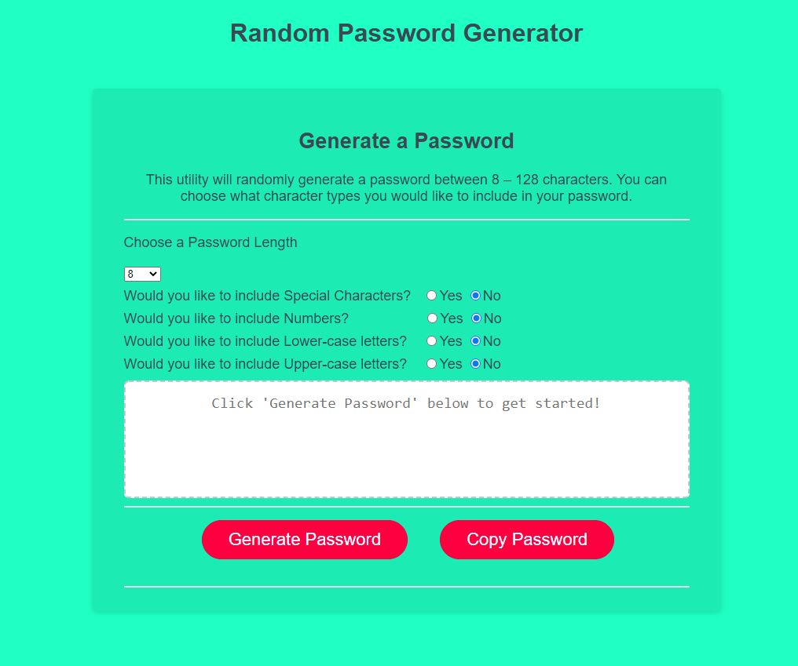

# Random Password Generator

As with any mere mortal, JavaScript send chills down my spine. I have never worked with this language and wanted to get a firm understanding of the basics. This random password generator

## Objective

- Create a fully functional, sharable application.
- Maintain accessibility standards, including using proper semantic HTML

[Random Password Generator](https://diegopie.github.io/password-generator/) is hosted on GitHub pages.

## Outcome

This project taught me the value of console logs and the satisfaction of JavaScript problem solving. I had no idea how to approach this application. I stared at a blank screen until I just started experimenting.
Does this work? Nope What about this? Nothing. This should work now? Why!
Through experimentation, research, and a lot of console logs I slowly inched closer to a functional application.  I refactored my entire code twice before polishing the structure that is here now. I do not want to say I am eager to learn more Java per se, but I am excited to expand my knowledge and optimize this project further.

Having revisited this app, I removed the alerts to make the UX much nicer and may add more polish later on

## Collaborators

I  would like to thank Christian for being a great study partner.
[https://www.elated.com/](https://www.elated.com/nested-arrays-in-javascript/) was a valuable resource.  
[developer.mozilla.org](https://developer.mozilla.org/en-US/docs/Mozilla/Add-ons/WebExtensions/Interact_with_the_clipboard#:~:text=To%20make%20the%20%22copy%22%20button,select()%3B%20document.) was, as ever, a valuable resource.

This application was authored by [Diego Hernandez](https://github.com/Diegopie)